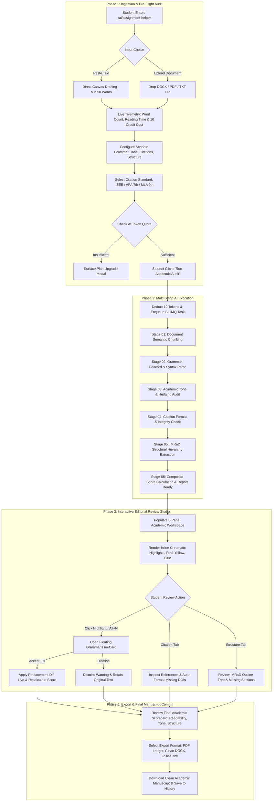

# StudySphere — AI Assignment Helper & Academic Writing Studio Master UI/UX Specification

**Module**: AI Assignment Helper & Academic Writing Studio (`/ai/assignment-helper`, `/ai/assignment-helper/report/:id`, `/ai/assignment-helper/history`)  
**Design Metaphor**: Academic Writing Studio + Peer Review Desk + Research Assistant (Academic OS Ledger)  
**Supported Platforms**: Web (React 19 + TailwindCSS) & Mobile (React Native + Expo)  
**Target Breakpoints**: Desktop (1440px Three-Panel Studio), Tablet (1024px Two-Panel Review Desk), Mobile (390px Guided Review Flow)

---

## 1. UX Goals & Design Philosophy

### 1.1 The Metaphor: The Collegiate Peer Review & Pre-Submission Desk
The StudySphere **AI Assignment Helper** is not a superficial auto-correct bot, generic ChatGPT chat interface, or flat text-replacement tool. It is an **Institutional Academic Writing Studio** where students and researchers refine term papers, lab manuals, and dissertations before formal academic submission:
- **Zero Chat Overhead**: No floating conversational chat bubbles or arbitrary AI chit-chat. The canvas is a structured academic document editor paired with real-time editorial ledgers.
- **Granular Editorial Control**: Every suggestion is an explicit proposal with justification, academic citations, and one-click `[ Accept ]` / `[ Reject ]` line-level diff microinteractions.
- **Scholarly Rigor**: Beyond grammar, the system enforces academic tone (eliminating colloquialisms, subjective hedging, and unsubstantiated claims), IEEE/APA/MLA citation standards, and IMRaD (Introduction, Methods, Results, Discussion) structural compliance.
- **Academic OS Ledger Typography**: High-density editorial layout utilizing Fraunces display headings, Inter body text for drafting legibility, and Geist Mono for reading metrics, reading times, and citation diffs.

### 1.2 Color & Token Allocation (Academic OS Ledger)
| Token | Hex Value | Semantic Usage in Assignment Helper |
| :--- | :--- | :--- |
| **Chalk Blue** | `#5B7FDE` | **Reserved for AI Operations**: Academic tone improvements, vocabulary elevation suggestions, pipeline step chain, and automated style insights. |
| **Quad Green** | `#2F5D50` | Accepted revisions, high readability scores (>= 85), valid citations, export triggers. |
| **Marker Yellow** | `#F2C14E` | Style warnings, passive voice warnings, low confidence citations, unverified claims. |
| **Destructive Red** | `#D9534F` | Grammatical errors, misspelled academic terminology, syntax violations, missing critical sections. |
| **Graphite** | `#8A8D85` | Monospace word count, reading time, token credit costs, citation metadata. |
| **Paper** | `#F3F4EF` (Light) / `#12151C` (Dark) | Clean academic writing canvas and review card backgrounds. |
| **Ink** | `#12151C` (Light) / `#F3F4EF` (Dark) | High-contrast high-legibility manuscript text and headings. |
| **Hairline Border** | `rgba(200, 203, 194, 0.8)` | Strict structural grid lines between editor, inline marks, and diagnostic panels. |

---

## 2. Information Architecture & Route Hierarchy

```
/ai/assignment-helper
├── (root)               # Page 1: 3-Panel Academic Writing Studio & Real-time Auditor
├── /report/:id          # Page 2: Comprehensive Pre-Submission Audit Ledger & Export
└── /history             # Page 3: Historical Document Archive & Version Ledger
```

---

## 3. End-to-End User & System Flow Architecture



### 3.1 Detailed Step-by-Step Flow Phases

#### Phase 1: Ingestion & Pre-Flight Validation
1. **User Action**: Student opens `/ai/assignment-helper`.
2. **System State**: Studio initializes in `Idle Canvas` state.
3. **Ingestion Options**:
   - **Mode A (Text Paste / Draft)**: User pastes text or types directly into `AssignmentEditor`. Client validates minimum word threshold (50 words) and maximum cap (20,000 words).
   - **Mode B (Document Upload)**: User drags a `.DOCX`, `.PDF`, or `.TXT` file into the dropzone. System runs text extraction, stripping formatting artifacts while preserving paragraph breaks and headers.
4. **Pre-Flight Telemetry**:
   - Gutter counters calculate live Word Count, Character Count, Estimated Reading Time (250 WPM), and analysis credit cost (`10 Credits`).
5. **Configuration Parameters**:
   - User toggles audit scopes: `[x] Grammar & Concord`, `[x] Academic Tone`, `[x] Citations & References`, `[x] Structural Hierarchy`.
   - User selects reference standard: `IEEE Standard` (CS/Engineering), `APA 7th` (Sciences), or `MLA 9th` (Humanities).
6. **Trigger**: User clicks `[ Run Academic Audit — 10 Credits ]`.

#### Phase 2: Multi-Stage AI Pipeline Execution
1. **Token Deduction & Locking**: System verifies credit balance, debits 10 credits from `token_usage`, and transitions the UI to the **Signature AI Step Chain**.
2. **Chalk Blue Step Chain Progression**:
   - `[01 DOCUMENT]`: Chunks manuscript and maps line numbers.
   - `[02 GRAMMAR]`: Detects subject-verb disagreements, dangling modifiers, punctuation errors, and spelling slips.
   - `[03 WRITING TONE]`: Flags conversational filler, subjective hedging (*"I think that"* ➔ *"The data demonstrates"*), and passive voice overload.
   - `[04 CITATIONS]`: Verifies in-text numeric/parenthetical tags against the bibliography and checks DOI/arXiv availability.
   - `[05 STRUCTURE]`: Analyzes heading hierarchy against academic IMRaD standards.
   - `[06 REPORT READY]`: Emits completed audit payload and renders the 3-panel workspace.

#### Phase 3: Interactive Editorial Resolution Flow
1. **Canvas Decoration**: Manuscript text is marked with three distinct inline highlight categories:
   - **Destructive Red Underlines**: Strict grammar/syntax errors.
   - **Marker Yellow Highlights**: Style, clarity, and wordiness warnings.
   - **Chalk Blue Highlights**: Vocabulary elevation and citation insertion suggestions.
2. **Contextual Issue Card Interaction**:
   - Clicking any highlighted phrase or pressing `Alt + N` anchors a floating `GrammarIssueCard`.
   - Card presents: Issue classification, academic pedagogical rationale, and side-by-side diff.
   - **Action: Accept (`Alt + A`)**: Instantly replaces text in the editor, updates the word count, recalculates the composite writing score in `WritingScoreCard`, and turns the badge Quad Green.
   - **Action: Dismiss (`Alt + R`)**: Strips the highlight and keeps student's original phrasing.
3. **Citation Workspace Flow**:
   - Student navigates to the Citations accordion tab.
   - System highlights formatting discrepancies (e.g., lowercase author names, missing publication years, unbracketed IEEE numbers).
   - One-click `[ Auto-Format All Citations ]` harmonizes the entire bibliography to the target standard.
4. **Structural Hierarchy Flow**:
   - Student navigates to the Structure outline tree.
   - If key sections (e.g. *Methodology*, *Limitations*, *Discussion*) are missing, Marker Yellow warning tags display with suggested writing prompts.

#### Phase 4: Final Manuscript Export & Archival
1. **Pre-Submission Scorecard**: Displays final evaluation (`Overall Grade: 94/100`, `Readability: 88`, `Tone: 92`, `Citations: 100% Valid`).
2. **Export Dropdown**:
   - `Export Clean DOCX`: Standard Microsoft Word format ready for upload to Canvas/Blackboard/Turnitin.
   - `Export Academic PDF`: Formatted collegiate layout with title page and two-column typesetting.
   - `Export LaTeX (.tex)`: Clean LaTeX source with embedded `\cite{}` keys.
3. **Archival**: Attempt is logged to `/ai/assignment-helper/history` for historical version tracking.


---

## 3. Signature AI Step Chain Pipeline

When an analysis is initiated, the studio renders an immutable **Chalk Blue Step Chain** reflecting exact progress:

```
[ 01 DOCUMENT ] ──→ [ 02 GRAMMAR ] ──→ [ 03 WRITING TONE ] ──→ [ 04 CITATIONS ] ──→ [ 05 STRUCTURE ] ──→ [ 06 REPORT READY ]
```

- **Active State**: Pulsing Chalk Blue capsule with vector inference spinner (`#5B7FDE`).
- **Completed State**: Solid Quad Green badge with checkmark (`#2F5D50`).
- **Queued State**: Graphite hairline capsule with estimated analysis tokens (`#8A8D85`).

---

## 4. Web Experience Specification (Desktop 1440px Three-Panel Studio)

```
┌──────────────────────────────────────────────────────────────────────────────────────────────────────────────────┐
│ [TOP BAR] AI Assignment Helper • "Distributed Systems Consensus Paper"      [Tokens: 880 cr] [History] [Export ▾]│
├──────────────────────────┬───────────────────────────────────────────────────────┬───────────────────────────────┤
│ LEFT PANEL (320px)       │ CENTER PANEL (760px)                                  │ RIGHT PANEL (360px)           │
│ Input & Configuration    │ Assignment Editor & Manuscript Surface                │ Diagnostic Ledger & Accordion │
│                          │                                                       │                               │
│ • Source Selector:       │ • Title: "Byzantine Fault Tolerance in Raft"          │ • Overall Writing Score:      │
│   [Text] [DOCX] [PDF]    │                                                       │   88 / 100 (Quad Green)       │
│                          │ • Manuscript Paragraphs:                              │                               │
│ • Manuscript Stats:      │   "Distributed consensus algorithms ensure data       │ • [Accordion 1: Grammar (3)]  │
│   - Words: 1,420 words   │    consistency across multiple nodes. [However, the]  │   - Red: Subject-verb concord │
│   - Reading Time: 5.2 min│    <- Red Highlight (Grammar Error)                   │                               │
│   - Token Cost: 10 cr    │                                                       │ • [Accordion 2: Tone (5)]     │
│                          │ • Inline Suggestion Card (Floating on click):         │   - Chalk: Replace "a lot of" │
│ • Analysis Checkboxes:   │   ┌───────────────────────────────────────────────┐   │     with "substantial"        │
│   [x] Grammar & Syntax   │   │ Issue: Colloquial Phrasing                    │   │                               │
│   [x] Academic Tone      │   │ Replace "a lot of servers" with "numerous"    │   │ • [Accordion 3: Citations (4)]│
│   [x] Citation Standards │   │ [✓ Accept Fix]               [✗ Dismiss]      │   │   - Format: IEEE Style        │
│   [x] Structure Tree     │   └───────────────────────────────────────────────┘   │   - 1 missing DOI link        │
│                          │                                                       │                               │
│ • Citation Style:        │ • Full text rendered in high-legibility Inter with   │ • [Accordion 4: Structure]    │
│   (o) IEEE  ( ) APA  ( ) │   monospace line numbers in left gutter.              │   - Abstract: [Found ✓]       │
│                          │                                                       │   - Methodology: [Found ✓]    │
│ • [ Run Analysis (10cr) ]│                                                       │   - Limitations: [Missing ⚑]  │
└──────────────────────────┴───────────────────────────────────────────────────────┴───────────────────────────────┘
```

### 4.1 Left Panel: Document Ingestion & Scope Configuration (`320px Fixed`)
1. **Input Mode Switcher**:
   - `[ Paste Manuscript Text ]`: Direct rich multiline drafting input with line numbers.
   - `[ Upload File (.DOCX, .PDF, .TXT) ]`: File dropzone with auto-extracted text preview.
2. **Real-time Manuscript Telemetry**:
   - `Word Count`: Monospace live counter (e.g., `1,420 Words`).
   - `Estimated Reading Time`: Calculated at 250 WPM (e.g., `5.7 min`).
   - `Token Cost Estimation`: Fixed `10 Credits` for standard papers (< 5,000 words).
3. **Audit Scopes Multi-Select**:
   - `[x] Grammar, Syntax & Punctuation` (Core grammatical concord).
   - `[x] Academic Tone & Vocabulary Elevation` (Formal phrasing, active voice).
   - `[x] Citation Integrity & Style Compliance` (Reference standard validation).
   - `[x] Structural Hierarchy & Section Completeness` (IMRaD outline audit).
4. **Citation Style Selector**:
   - `[ IEEE Standard ]` (Engineering & CS) • `[ APA 7th Edition ]` (Social Sciences) • `[ MLA 9th ]` (Humanities).
5. **Action Trigger**:
   - `[ Run Academic Audit — 10 Credits ]` (Quad Green primary CTA).

---

### 4.2 Center Panel: Manuscript Workspace (`AssignmentEditor` — `760px Flex`)
1. **Gutter & Text Surface**:
   - Monospace line numbers in left gutter for exact line referencing.
   - High-contrast Inter typography with 1.75 line-height for fatigue-free reading.
2. **Inline Chromatic Highlights**:
   - **Destructive Red Underline (`border-b-2 border-destructive`)**: Grammar error, spelling mistake, or missing punctuation.
   - **Marker Yellow Highlight (`bg-marker/20 text-ink`)**: Style warnings, ambiguous phrasing, wordiness, or passive voice.
   - **Chalk Blue Highlight (`bg-chalk/15 text-chalk font-semibold`)**: AI vocabulary elevation, technical term enrichment, or citation insertion suggestion.
3. **Floating Contextual Fix Card (`GrammarIssueCard`)**:
   - Clicking any highlighted snippet opens a floating popover anchored directly to the selected word:
     - **Issue Category**: E.g., `Informal Collocation (Line 42)`.
     - **Contextual Explanation**: *"Academic writing favors precise quantification over colloquial descriptors."*
     - **Diff Preview**: `a lot of nodes` ➔ `numerous distributed instances`.
     - **Actions**: `[ ✓ Accept & Replace ]` (Applies diff in real-time) • `[ ✗ Dismiss ]`.

---

### 4.3 Right Panel: Diagnostic Ledger (`SuggestionPanel` — `360px Fixed`)
Organized as a multi-section Academic Accordion:

#### 1. Writing Quality Metric Card (`WritingScoreCard`)
- **Overall Score Radial / Monospace Score**: `88 / 100` (`Quad Green`).
- **Granular Dimension Sliders**:
  - `Readability (Flesch-Kincaid)`: `84 / 100` (Collegiate Grade Level).
  - `Clarity & Conciseness`: `90 / 100`.
  - `Grammatical Precision`: `92 / 100`.
  - `Academic Tone`: `82 / 100`.
  - `Structural Organization`: `86 / 100`.

#### 2. Citation Integrity Ledger (`CitationCard`)
- Displays all detected in-text citations vs. the bibliography ledger.
- **Reference Card**:
  - `Type`: Journal Article / Conference Paper / Web Source.
  - `Detected Format`: E.g., `IEEE Format: [1] L. Lamport, "Paxos Made Simple," 2001.`
  - `Missing Metadata Alert`: Marker Yellow tag: `Missing DOI URL`.
  - `Actions`: `[ Copy Formatted Citation ]` • `[ Apply Fix to Bibliography ]`.

#### 3. Structural Hierarchy Outline (`StructureOutline`)
- Visualizes the paper's section tree based on academic IMRaD standards:
  - `Title & Abstract`: `[ Verified ✓ ]`
  - `Introduction & Problem Statement`: `[ Verified ✓ ]`
  - `Literature Review / Related Work`: `[ Verified ✓ ]`
  - `Methodology / System Architecture`: `[ Verified ✓ ]`
  - `Experimental Results & Evaluation`: `[ Verified ✓ ]`
  - `Discussion & Limitations`: `[ Missing ⚑ — Recommended for Journal Submission ]`
  - `References / Bibliography`: `[ 14 Citations Found ✓ ]`

---

## 5. Comprehensive Citation Workspace Specification

### 5.1 Style Compliance Matrix
| Feature | IEEE Standard | APA 7th Edition | MLA 9th Edition |
| :--- | :--- | :--- | :--- |
| **In-Text Citation** | Numeric bracket `[1]`, `[2]-[4]` | Author-Date `(Lamport, 2001)` | Author-Page `(Lamport 45)` |
| **Reference Ordering** | Sequential as cited in text | Alphabetical by author surname | Alphabetical by author surname |
| **Author Name Format** | `J. K. Author` (Initials first) | `Author, J. K.` (Last name first) | `Author, John K.` (Full name) |
| **DOI / URL Standard** | `doi: 10.1145/...` or hyperlinked | `https://doi.org/10.1145/...` | `https://doi.org/10.1145/...` |

### 5.2 Citation Generator & Fix Flow
1. **Raw Reference Paste**: Student pastes unstructured text e.g., *"Silberschatz operating systems 10th edition 2018"*.
2. **AI Reference Canonicalization**: System queries CrossRef/arXiv metadata and converts into verified canonical format:
   - `IEEE`: `[1] A. Silberschatz, P. B. Galvin, and G. Gagne, Operating System Concepts, 10th ed. Hoboken, NJ: Wiley, 2018.`
3. **One-Click Insert**: Button `[ + Insert at Cursor ]` inserts both the in-text tag and formats the references list.

---

## 6. Mobile Experience Specification (React Native + Expo)

### 6.1 Mobile Single-Column Review Flow
On mobile devices (390px), the workspace utilizes a focused **5-Step Guided Review Flow**:

```
┌────────────────────────────────────────┐
│ [Back] AI Assignment Helper   [🌙 Dark] │
├────────────────────────────────────────┤
│ [ STEP: 03 GRAMMAR & STYLE REVIEW ]    │
│ Progress: 3 of 5 Issues Resolved       │
├────────────────────────────────────────┤
│ [MANUSCRIPT CARD]                      │
│ Line 14 • Paragraph 2                  │
│                                        │
│ Distributed databases requires robust  │
│ consensus mechanisms...                │
│ [ ^ requires -> require ] (Red)        │
├────────────────────────────────────────┤
│ [BOTTOM ACTION SHEET]                  │
│ Subject-Verb Agreement Error           │
│ Plural subject "databases" takes       │
│ base verb "require".                   │
│                                        │
│ [ ✓ ACCEPT FIX ]   [ ✗ DISMISS ]       │
├────────────────────────────────────────┤
│ [TABS: Overview | Grammar | Citations] │
└────────────────────────────────────────┘
```

### 6.2 Mobile Bottom Sheet Interactions
- **Tap Highlighted Issue**: Tapping an underlined term opens a native bottom sheet with clear explanation and oversized touch targets (`48px`) for `[ Accept Fix ]` and `[ Dismiss ]`.
- **Swipe Between Issues**: Swiping left/right on the issue card automatically scrolls the manuscript to the next highlighted issue.

---

## 7. Comprehensive State Matrix

| State | Trigger Condition | Visual Representation | User Actions Available |
| :--- | :--- | :--- | :--- |
| **1. Idle Canvas** | User navigates to `/ai/assignment-helper`. | Clean editor with placeholder text and source selection cards. | Paste text, upload file, select citation style. |
| **2. Ingestion / Parsing** | User uploads a `.DOCX` or `.PDF`. | Uploading progress bar with word count extraction badge. | Cancel upload, replace file. |
| **3. Processing Pipeline** | User clicks `[ Run Academic Audit ]`. | Chalk Blue Step Chain with spinning stage capsule (`Analyzing Tone...`). | View progress, cancel job. |
| **4. Analysis Active** | Processing completes successfully. | Three-panel studio populated with inline highlights, scorecards, and outline. | Accept/reject fixes, copy citations, export. |
| **5. Low Token Balance** | User credits < 10 credits. | Marker Yellow alert: `Insufficient AI credits (4 remaining)`. | Upgrade Plan CTA, view past reports. |
| **6. File Size Exceeded** | User uploads file > 10MB or > 20k words. | Destructive Red banner: `Document exceeds 20,000 words limit`. | Truncate document, upload excerpt. |
| **7. Exporting** | User clicks `[ Export Clean Manuscript ]`. | Modal with format choices: `PDF (Academic Layout)`, `DOCX`, `LaTeX (.tex)`. | Download formatted manuscript. |

---

## 8. Developer Handoff: Redux Slices, Schemas & API Contracts

### 8.1 Shared Zod Schemas (`packages/shared-schemas/src/ai.schema.ts`)
```typescript
import { z } from "zod";

export const assignmentAnalyzeSchema = z.object({
  text: z.string().trim().min(50).max(20000).optional(),
  fileUrl: z.string().url().optional(),
  citationStyle: z.enum(["APA", "MLA", "IEEE"]).default("IEEE"),
  analysisTypes: z.array(z.enum(["grammar", "tone", "citations", "structure"])).min(1),
}).refine((d) => !!d.text || !!d.fileUrl, {
  message: "Submit at least 50 words or upload a document",
  path: ["text"],
});
```

### 8.2 Client Redux Slice (`assignmentSlice.ts`)
```typescript
export interface GrammarIssue {
  id: string;
  line: number;
  originalText: string;
  suggestedText: string;
  category: 'grammar' | 'style' | 'tone' | 'spelling';
  explanation: string;
  status: 'pending' | 'accepted' | 'rejected';
}

export interface CitationItem {
  id: string;
  rawText: string;
  formattedText: string;
  style: 'APA' | 'MLA' | 'IEEE';
  missingFields?: string[];
  isValid: boolean;
}

export interface AssignmentHelperState {
  rawText: string;
  citationStyle: 'APA' | 'MLA' | 'IEEE';
  activeIssueId: string | null;
  grammarIssues: GrammarIssue[];
  citations: CitationItem[];
  writingScore: {
    overall: number;
    readability: number;
    clarity: number;
    grammar: number;
    tone: number;
    structure: number;
  } | null;
  structureOutline: Array<{ section: string; status: 'found' | 'missing'; recommendation?: string }>;
  isAnalyzing: boolean;
}
```

### 8.3 RTK Query API Endpoints (`aiApi.ts`)
- `POST /api/ai/assignment/analyze`: Accepts text/document, triggers background audit, returns structured findings.
- `POST /api/ai/assignment/citation/format`: Converts raw reference string into canonical APA/MLA/IEEE entry.
- `GET /api/ai/assignment/reports`: Returns user's past assignment audit history.
- `GET /api/ai/assignment/report/:id`: Retrieves saved report with full diff history.

---

## 9. Accessibility (WCAG 2.1 AA Compliance)
1. **Keyboard Navigation**:
   - `Tab` navigates between inline highlights in sequential order.
   - `Alt + A`: Accept active suggestion.
   - `Alt + R`: Reject active suggestion.
   - `Alt + N` / `Alt + P`: Next/Previous suggestion.
2. **Screen Reader Announcements**:
   - Inline highlights contain `aria-label="Grammar issue: [Error]. Press Enter to review fix."`
3. **Contrast Compliance**:
   - All chromatic highlight backgrounds maintain a minimum `4.5:1` contrast ratio against black/white manuscript text.
