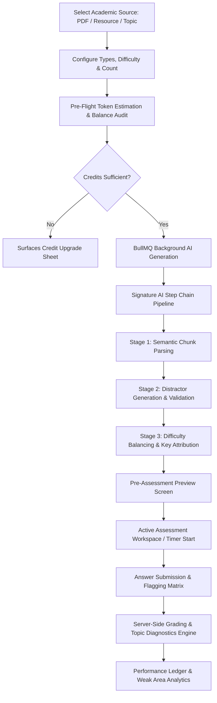

# StudySphere — AI Quiz Generator & Assessment Master UI/UX Flow Specification

**Module**: AI Quiz Generator & Learning Assessment Engine (`/ai/quiz/new`, `/quiz/:id/attempt`, `/quiz/:id/results`, `/ai/quiz/history`)  
**Design Metaphor**: Assessment Workspace + Exam Simulator + Learning Analytics Engine (Academic OS Ledger)  
**Supported Platforms**: Web (React 19 + TailwindCSS) & Mobile (React Native + Expo)  
**Target Breakpoints**: Desktop (1440px Three-Panel), Tablet (1024px Two-Panel), Mobile (390px Single-Column Flow)

---

## 1. UX Goals & Design Philosophy

### 1.1 The Metaphor: The Collegiate Exam Hall & Analytics Desk
The StudySphere **AI Quiz Generator** is not a superficial trivia game or conversational ChatGPT chat screen. It is an **Institutional-Grade Learning & Self-Assessment Engine** designed for collegiate rigorous examination:
- **Zero Chat Bloat**: No conversational bot personality; inputs are structured academic materials (Lecture PDFs, Resource Hub entries, or Syllabus Topic Texts) and outputs are verifiable assessment ledgers.
- **Server-Authoritative Timing & Anti-Tamper State**: Exam timers, active attempt locks, and randomized question ordering are validated server-side. Mid-attempt disconnects or mobile app backgrounding seamlessly resume without losing recorded answers.
- **Formative Feedback Loop**: A quiz does not end at a score percentage. It provides deep **Weak Area Topic Diagnostics** and detailed model explanations derived directly from course syllabus concepts.
- **Dense & Verifiable Typography**: Geist UI, Fraunces editorial titles, Inter body questions, and Geist Mono numerical matrices with hairline borders (`1px border-border`).

### 1.2 Color & Token Allocation (Academic OS Ledger)
| Token | Hex Value | Semantic Usage in AI Quiz Module |
| :--- | :--- | :--- |
| **Chalk Blue** | `#5B7FDE` | **Reserved for AI Operations**: Generation capsules, pipeline steps, AI cost estimations, and automated diagnostics. |
| **Quad Green** | `#2F5D50` | Correct answers, passed benchmarks, completed questions, submission buttons. |
| **Marker Yellow** | `#F2C14E` | **Review Flagged Questions**, medium difficulty tags, low token alerts. |
| **Destructive Red** | `#D9534F` | Incorrect answers, unanswered warning badges, critical time warning (<2 min). |
| **Graphite** | `#8A8D85` | Monospace timers, question numbers, unattempted grid pills, metadata tags. |
| **Paper** | `#F3F4EF` (Light) / `#12151C` (Dark) | Clean examination surface backgrounds. |
| **Ink** | `#12151C` (Light) / `#F3F4EF` (Dark) | High-contrast high-legibility question text and headers. |
| **Hairline Divider** | `rgba(200, 203, 194, 0.8)` | Strict grid dividers between navigator, question cards, and ledger tables. |

---

## 2. Information Architecture & Route Hierarchy

```
/ai/quiz
├── /new                 # Page 1: AI Quiz Configuration & Source Selector
├── /preview/:id         # Page 2: Pre-Assessment Specification & Topic Scope
├── /history             # Page 5: Academic Attempt Ledger & Historical Analytics
/quiz
├── /:id/attempt         # Page 3: Server-Authoritative Exam Simulation Workspace
└── /:id/results         # Page 4: Performance Diagnostics & Topic Mastery Ledger
/faculty
└── /quizzes
    ├── /new             # Faculty Class Assessment Creator (Assign & Due Dates)
    └── /:id/analytics   # Faculty Cohort Performance Heatmap & Question Discrimination
```



---

## 3. Signature AI Step Chain Pipeline

StudySphere renders an immutable **Chalk Blue Step Chain** during generation:

```
[ 01 SOURCE ] ──→ [ 02 ANALYZING ] ──→ [ 03 EXTRACTION ] ──→ [ 04 DIFFICULTY BALANCING ] ──→ [ 05 QUIZ READY ]
```

- **Active State**: Pulsing Chalk Blue capsule with vector inference spinner (`#5B7FDE`).
- **Completed State**: Solid Quad Green badge with checkmark (`#2F5D50`).
- **Queued State**: Graphite hairline capsule with estimated token cost (`#8A8D85`).

---

## 4. Page Specifications (Web 1440px Desktop)

### 4.1 Page 1: AI Quiz Setup (`/ai/quiz/new`)

#### Layout: Two-Column Academic Split Ledger
- **PageHeader**:
  - Title: `AI Quiz Generator` (Fraunces Display font, 24px/32px bold Ink).
  - Subtitle: `Generate intelligent quizzes from academic material and measure comprehension through structured analytics.`
  - Action Controls: `[ Quiz History Ledger ]` and `[ Saved Question Banks ]`.
  - Metric: `TokenUsageIndicator` (e.g., `880 / 1000 AI Tokens Available`).

#### Left Panel: Configuration Form (`580px Flex`)
1. **Source Selection Deck (Mutually Exclusive Cards)**:
   - **Card 1: Upload Document (`.PDF`, `.DOCX`, `.PPTX`, `.TXT`)** — Drag & drop zone with file metadata inspection.
   - **Card 2: Existing Resource** — Integrated searchable picker connecting directly to verified Resource Hub catalog entries.
   - **Card 3: Syllabus Topic Text** — Textarea with quick suggestions (e.g., *"OS Process Scheduling & Deadlock Avoidance"*).
2. **Question Type Multi-Select Chips**:
   - `[ ] Multiple Choice (MCQ)` (Single correct answer with 4 plausible distractor keys).
   - `[ ] Fill in the Blanks` (Case-insensitive keyword extraction).
   - `[ ] Short Answer / Recall` (1-2 sentence conceptual recall with model grading criteria).
   - `[ ] Conceptual Proofs / Explanations` (Higher-order Bloom's taxonomy).
   - `[ ] True / False` (Theorem & boundary case checks).
   - `[ Quick Action: Select All / Mixed Quiz ]`.
3. **Difficulty Tier Segmented Control**:
   - `[ Easy (30%) ]` • `[ Medium (50%) ]` • `[ Hard (20%) ]` • `[ Mixed Adaptive ]`.
4. **Question Count Stepper & Range Slider**:
   - Range: `1` to `50` questions (Default: `10` questions, Faculty: up to `100`).
5. **Time Limit Configuration**:
   - Optional Server Timer: `No Limit` or slider `1` to `180` minutes (Default: `1.5 min / question`).

#### Right Panel: Generation Preview & Pre-Flight Audit (`420px Fixed`)
1. **Pre-Flight Audit Table**:
   - `Selected Source`: *DBMS Unit 3 Normalization (24 Pages)*
   - `Question Count`: *15 Questions*
   - `Estimated Duration`: *22 Minutes*
   - `Token Cost`: *140 AI Credits*
   - `Account Balance After`: *740 AI Credits*
2. **Projected Difficulty Distribution Chart**:
   - Visual segmented bar: `4 Easy` (27%) | `8 Medium` (53%) | `3 Hard` (20%).
3. **Primary CTA**:
   - `[ Generate AI Assessment — 140 Credits ]`: Full-width Quad Green action button with Chalk Blue progress animation.

---

### 4.2 Page 2: Quiz Preview Screen (`/quiz/:id/preview`)

#### Purpose: Pre-flight briefing before timer initialization
- **Quiz Metadata Card**:
  - Quiz Title, Subject Code, Generation Timestamp, Total Questions, Total Marks, Time Limit.
- **Syllabus Coverage Breakdown**:
  - Tags matching exact lecture modules (e.g., `#BCNF`, `#DependencyPreservation`, `#LosslessDecomposition`).
- **Collapsed Question Outline**:
  - Shows question types and marks allocation without revealing answers.
- **Action Buttons**:
  - `[ Begin Assessment Now ▶ ]` (Initializes server session & starts timer).
  - `[ Regenerate with Directive ↺ ]` (Modify focus e.g. *"More proofs on 3NF"*).
  - `[ Save to Question Bank 💾 ]`.

---

### 4.3 Page 3: Quiz Attempt Workspace (`/quiz/:id/attempt`)

```
┌──────────────────────────────────────────────────────────────────────────────────────────────────┐
│ [TOP BAR] DBMS Unit 3 Assessment • Question 04 / 15      [Timer: 00:18:42] [Flag] [Submit Exam]  │
├──────────────────────────┬───────────────────────────────────────┬───────────────────────────────┤
│ LEFT PANEL (260px)       │ CENTER PANEL (760px)                  │ RIGHT PANEL (300px)           │
│ Question Navigator Grid  │ Primary Question Card Surface         │ Assessment Controls & Status  │
│                          │                                       │                               │
│ [01✓] [02✓] [03✓] [04●]  │ • Question Type: Single Choice MCQ    │ • Time Remaining:             │
│ [05⚑] [06 ] [07 ] [08 ]  │ • Marks: [2 Marks] • Difficulty: [MED]│   00:18:42 (Server Locked)    │
│ [09 ] [10 ] [11 ] [12 ]  │ • Question Text:                      │ • Answered: 3 / 15 (20%)      │
│ [13 ] [14 ] [15 ]        │   "Which normal form strictly         │ • Flagged for Review: 1       │
│                          │    guarantees that all non-trivial    │ • Unanswered: 11              │
│ Grid Legend:             │    dependencies X -> Y have X as      │                               │
│  ● Current   ✓ Answered  │    a superkey?"                       │ • [ Previous Question ]       │
│  ⚑ Flagged   ◻ Blank     │ • Interactive Option Radios (A,B,C,D) │ • [ Next Question ]           │
│                          │ • [ Clear Choice ]  [ Flag Question ] │ • [ Submit Assessment ] (Quad)│
└──────────────────────────┴───────────────────────────────────────┴───────────────────────────────┘
```

#### Left Panel: Question Navigator (`260px Fixed`)
- **Interactive Question Pill Matrix (Grid layout 4 x N)**:
  - `Answered`: Solid Quad Green pill (`#2F5D50`) with checkmark `✓`.
  - `Flagged for Review`: Marker Yellow outline pill (`#F2C14E`) with flag icon `⚑`.
  - `Current Active`: Chalk Blue highlight with high-contrast border (`#5B7FDE`).
  - `Unanswered`: Neutral Graphite background (`#8A8D85`).
- **Legend Counter**: Monospace real-time tally.

#### Center Panel: Question Surface (`QuizQuestionCard` — `760px Flex`)
- **Header**:
  - Question Number, Question Type (`MCQ`, `Fill Blank`, `Conceptual`), Marks Badge (`2 Marks`), Difficulty Tag (`Medium`).
- **Question Prompt**:
  - High-legibility Inter typography with LaTeX equation rendering (`$$X \rightarrow Y$$`) and embedded diagrams where applicable.
- **Interactive Answer Input**:
  - **MCQ**: 4 bordered option containers with keyboard shortcuts (`1`, `2`, `3`, `4` or `A`, `B`, `C`, `D`).
  - **Fill in the Blanks**: Monospace inline text input with character hint.
  - **Short Answer**: Multi-line structured response box with word count validator.
  - **True/False**: Two segmented pill buttons.
- **Footer Toolbar**:
  - `[ Clear Selection ]` • `[ Flag for Review (F) ]` • `[ Previous (←) ]` • `[ Save & Next (→) ]`.

#### Right Panel: Assessment Controls (`300px Fixed`)
- **Server-Authoritative Countdown Clock (`QuizTimer`)**:
  - Rendered in Geist Mono (`00:18:42`).
  - Transitions to **Marker Yellow** at `< 5 min` and **Destructive Red** with heartbeat pulse at `< 2 min`.
- **Submission Progress Audit**:
  - Real-time progress bar + percentage completed.
- **Submit Assessment Primary CTA**:
  - Clicking `[ Submit Assessment ]` triggers an audit modal showing unanswered/flagged summaries before final submission.

---

### 4.4 Page 4: Quiz Results & Learning Analytics (`/quiz/:id/results`)

#### Section 1: Honors Scorecard & Performance Metrics
- **Main Hero Banner**:
  - Score percentage (`92%`), Total Marks (`18.5 / 20`), Percentile standing (`Top 5% in Cohort`), Time Elapsed (`14m 22s`).
- **Performance Pill Deck**:
  - `14 Correct` (Quad Green) • `1 Incorrect` (Destructive Red) • `0 Skipped` (Graphite) • `93.3% Accuracy`.

#### Section 2: Weak Area Topic Diagnostic Engine (Core Pedagogical Value)
- **Topic Mastery Ledger Table**:
  | Sub-Topic | Questions Tested | Score | Status | Recommended Action |
  | :--- | :--- | :--- | :--- | :--- |
  | **BCNF Superkey Rule** | 4 Qs | 100% | `Mastered` | Ready for advanced queries |
  | **Lossless Decomposition** | 6 Qs | 83% | `Proficient` | Review 1 proof step |
  | **Multivalued Dependencies (4NF)** | 5 Qs | 40% | `Needs Revision` | [Generate 5-min Revision Kit ↗] |

- **One-Click Targeted Remediation**:
  - Button: `[ ⚡ Generate Remediation Flashcards for 4NF ]` (Connects directly to AI Notes Summarizer).

#### Section 3: Exhaustive Question Review Ledger
Every question is rendered with full transparency:
- Student's Selected Answer vs. System Correct Key.
- Detailed step-by-step academic justification derived from lecture notes.
- Attribution citation (e.g., *"Derived from Syllabus Section 3.4, Page 18"*).

---

### 4.5 Page 5: Historical Assessment Ledger (`/ai/quiz/history`)

- **Search & Filters Bar**:
  - Search by Topic, Filter by Subject, Filter by Score Range (`>= 90%`, `70-89%`, `< 70%`), Date Range.
- **Historical Table Columns**:
  1. `Assessment Title & Subject`
  2. `Date & Time Taken`
  3. `Questions & Difficulty`
  4. `Score & Accuracy %`
  5. `Time Taken`
  6. `Actions`: `[ Review Breakdown ]`, `[ Retake Assessment ↺ ]`, `[ Export PDF Ledger ]`.

---

## 5. Mobile Experience Specification (React Native + Expo)

### 5.1 Mobile Assessment Flow (Single-Column Adaptive)
On mobile devices (390px), the 3-panel layout adapts into a focused, distraction-free **Single-Column Exam Hall**:

```
┌────────────────────────────────────────┐
│ [Back] DBMS Quiz • Q 04/15    [🌙 Dark] │
├────────────────────────────────────────┤
│ [TIMER: 00:18:42]  [ Progress: 27% ]   │
├────────────────────────────────────────┤
│ [QUESTION CARD]                        │
│ 2 Marks • Medium                       │
│                                        │
│ Which normal form strictly eliminates  │
│ transitive functional dependencies?    │
│                                        │
│ (A) First Normal Form (1NF)            │
│ (B) Second Normal Form (2NF)           │
│ (C) Third Normal Form (3NF)     ●      │
│ (D) Boyce-Codd Normal Form (BCNF)      │
├────────────────────────────────────────┤
│ [ ⚑ Flag ]   [ ▦ Grid ]   [ Next ▶ ]   │
│                                        │
│ [ SUBMIT ASSESSMENT ] (Quad Green)     │
└────────────────────────────────────────┘
```

### 5.2 Mobile Touch Interactions & Anti-Distraction Controls
1. **Swipe Navigation**:
   - `Swipe Left`: Navigate to next question.
   - `Swipe Right`: Navigate to previous question.
2. **Bottom Sheet Navigator**:
   - Tapping `[ ▦ Grid ]` opens a native bottom sheet presenting the full 1..N question status matrix for fast jumping.
3. **App Backgrounding Resilience**:
   - `quizSlice` auto-saves the active answers map to `AsyncStorage` on every option select. If a phone call interrupts the attempt, state is fully restored on app foregrounding.
4. **Locked Screen Mid-Attempt**:
   - Tab bar is hidden during quiz attempts to prevent accidental tab switches.

---

## 6. Faculty View & Class Analytics (`/faculty/quizzes`)

When logged in as a faculty member (`role === 'faculty'`):
1. **Assign to Course Cohort**:
   - Select Branch, Semester, and Course Subject.
   - Set Availability Window: `Start Date/Time` to `Due Date/Time`.
   - Toggle: `Show Explanations Immediately` vs `Show After Deadline`.
2. **Cohort Analytics Dashboard**:
   - **Average Score & Median Time**.
   - **Score Distribution Curve** (Bell curve histogram).
   - **Question Discrimination Index Table**: Identifies questions where high-performing students struggled (revealing confusing lecture topics).
   - **Export Gradebook CSV**: One-click download formatted for university records.

---

## 7. Comprehensive State Matrix

| State | Trigger Condition | Visual Representation | User Actions Available |
| :--- | :--- | :--- | :--- |
| **1. Idle Setup** | User lands on `/ai/quiz/new`. | Configuration form with accepted source cards & difficulty pills. | Upload file, select resource, configure count. |
| **2. Generating** | User clicks `[ Generate Quiz ]`. | Chalk Blue Step Chain with spinning vector extraction step. | Background execution toggle (`Notify me`). |
| **3. Active Attempt** | User starts quiz. | High-contrast exam workspace with live server countdown timer. | Select options, flag questions, clear choice, submit. |
| **4. Time Expired** | Server timer hits `00:00:00`. | Red alert banner: `Time Elapsed. Auto-submitting attempt...` | Automatic transition to grading screen. |
| **5. Results Ready** | Backend calculates score. | Honors scorecard with topic mastery table & question explanations. | Review answers, generate remediation kit, retake. |
| **6. Token Exhausted** | User credits < estimated quiz cost. | Marker Yellow notice: `Insufficient AI Credits for 20 Questions`. | Reduce question count, upgrade to Pro Tier. |
| **7. Empty History** | User visits history with 0 attempts. | Minimal academic illustration: `No Assessments Recorded Yet.` | `[ Generate First Quiz ]` CTA. |

---

## 8. Developer Handoff: Redux Slices, Schemas & API Contracts

### 8.1 Zod Schemas (`packages/shared-schemas/src/quiz.schema.ts`)
```typescript
import { z } from "zod";

export const quizGenerateSchema = z.object({
  source: z.enum(["upload", "resource", "topic_text"]),
  sourceRef: z.string().min(1),
  questionTypes: z.array(z.enum(["mcq", "fill_blank", "short_answer", "true_false", "conceptual"])).min(1),
  difficulty: z.enum(["easy", "medium", "hard", "mixed"]),
  questionCount: z.number().int().min(1).max(50),
  timeLimitMinutes: z.number().int().min(1).max(180).optional(),
});

export const submitAnswerSchema = z.object({
  attemptId: z.string().uuid(),
  questionId: z.string().uuid(),
  selectedAnswer: z.union([z.string(), z.array(z.string()), z.number(), z.boolean()]),
});

export const submitAttemptSchema = z.object({
  attemptId: z.string().uuid(),
});
```

### 8.2 Client Redux Slice (`quizSlice.ts`)
```typescript
export interface QuizAttemptState {
  activeQuizId: string | null;
  activeAttemptId: string | null;
  currentQuestionIndex: number;
  answers: Record<string, any>;
  markedForReview: string[];
  serverTimeRemainingSeconds: number;
  isSubmitting: boolean;
  status: 'idle' | 'in_progress' | 'submitted' | 'graded';
}
```

### 8.3 RTK Query API Endpoints (`quizApi.ts` & `aiApi.ts`)
- `POST /api/ai/quiz/generate`: Generates question set and registers quiz.
- `POST /api/quiz/attempt/start`: Initializes attempt ID, server timer, and question ordering.
- `POST /api/quiz/attempt/answer`: Upserts real-time answer selection.
- `POST /api/quiz/attempt/submit`: Finalizes attempt and triggers auto-grading.
- `GET /api/quiz/attempt/:id/results`: Returns score, topic breakdown, and question explanations.
- `GET /api/quiz/history`: Returns paginated past attempts ledger.

---

## 9. Accessibility (WCAG 2.1 AA Compliance)
1. **Keyboard Shortcuts (Assessment Workspace)**:
   - `1` / `2` / `3` / `4` or `A` / `B` / `C` / `D`: Select option.
   - `F`: Toggle flag for review.
   - `Arrow Right` / `Enter`: Next question.
   - `Arrow Left`: Previous question.
2. **Screen Reader Announcements**:
   - `aria-live="polite"` region announcing timer remaining at 10-minute, 5-minute, and 1-minute milestones.
3. **Contrast Compliance**:
   - All text and question cards maintain a minimum `4.5:1` contrast ratio against the Paper background in both Light and Dark themes.
