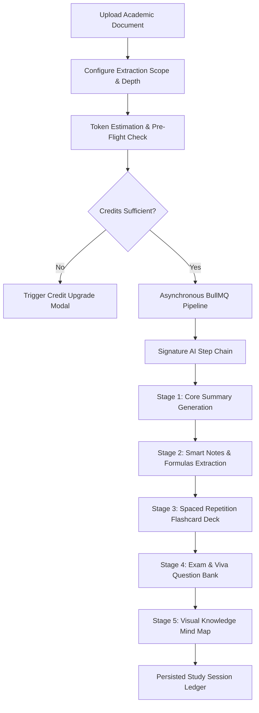

# StudySphere — AI Notes Summarizer Master UI/UX & Flow Specification
**Module**: AI Notes Summarizer (`/ai/summarizer`)  
**Design Philosophy**: Academic OS Ledger (Research Desk + Academic Analysis Tool)  
**Supported Platforms**: Web (React 19 + TailwindCSS) & Mobile (React Native + Expo)  
**Target Widths**: Desktop (1440px Three-Panel), Tablet (1024px Two-Panel), Mobile (390px Single-Column Flow)

---

## 1. UX Goals & Design Philosophy

### 1.1 The Metaphor: The Academic Research Desk
The StudySphere **AI Notes Summarizer** is not a generic AI chatbot or conversational bubble interface. It is engineered as a **High-Throughput Academic Synthesis Workspace** designed for collegiate rigorous study:
- **Zero Chat Bloat**: No conversational back-and-forth; documents enter as raw academic artifacts and exit as complete, interconnected **Study Kits**.
- **Unified Academic Session**: Every extraction (Summary, Smart Notes, Flashcard Deck, Important Exam Questions, Formula Ledger, and Knowledge Mind Map) is bound to a single immutable **Study Session Ledger**.
- **Verifiable & Dense**: Dense typography, hairline borders (`1px border-border`), monospace token counts, and transparent attribution to exact document source pages.

### 1.2 Color & Token Allocation (Academic OS Ledger)
| Token | Hex Value | Semantic Usage in AI Summarizer |
| :--- | :--- | :--- |
| **Chalk Blue** | `#5B7FDE` | **Reserved exclusively for AI**: Generation capsules, streaming cursors, AI step badges, token indicators, and vector inference status. |
| **Quad Green** | `#2F5D50` | Verified summaries, completed pipeline steps, export actions, success badges. |
| **Marker Yellow** | `#F2C14E` | High-priority exam formulas, low token warnings, revision highlights. |
| **Graphite** | `#8A8D85` | Metadata lines, page numbers, word counts, token costs, secondary labels. |
| **Paper** | `#F3F4EF` (Light) / `#12151C` (Dark) | Clean academic page surfaces. |
| **Ink** | `#12151C` (Light) / `#F3F4EF` (Dark) | High-contrast editorial headlines and body typography. |
| **Hairline Border** | `rgba(200, 203, 194, 0.8)` | Strict grid dividers between panels and audit tables. |

---

## 2. Information Architecture & Route Hierarchy

```
/ai/summarizer
├── / (Main Workspace: 3-Panel Document Synthesizer)
├── /history (Academic Session Ledger & Audit Log)
└── /session/:id (Read-Only / Interactive Saved Study Kit)
```



---

## 3. Signature AI Step Chain

StudySphere displays an immutable **Progress Capsule Pipeline** rendered in Chalk Blue across the top of both web and mobile workspaces:

```
[ 01 DOCUMENT ] ──→ [ 02 SUMMARY ] ──→ [ 03 NOTES ] ──→ [ 04 FLASHCARDS ] ──→ [ 05 QUESTIONS ] ──→ [ 06 MIND MAP ]
```

- **Active State**: Pulsing Chalk Blue capsule with streaming spinner (`#5B7FDE`).
- **Completed State**: Solid Quad Green badge with checkmark (`#2F5D50`).
- **Queued State**: Graphite hairline capsule with monospace estimate (`#8A8D85`).

---

## 4. Web Experience Specification (Desktop 1440px)

### 4.1 Page Header (`PageHeader`)
- **Title**: `AI Notes Summarizer` (Fraunces Display font, 24px/32px, bold Ink).
- **Subtitle**: `Transform academic lecture material into verified summaries, flashcards, formula ledgers, and visual study maps.`
- **Top Actions**:
  - `[ History Ledger ]`: Routes to `/ai/summarizer/history`.
  - `[ Saved Sessions ]`: Opens quick-drawer modal of pinned kits.
- **Top Metrics**:
  - `TokenUsageIndicator`: Live monthly token quota display (e.g., `880 / 1000 AI Tokens Available` with Chalk Blue progress ring).

---

### 4.2 Three-Panel Workspace Architecture

```
┌──────────────────────────────────────────────────────────────────────────────────────────────────┐
│ [PAGE HEADER] AI Notes Summarizer                      [Token Indicator] [History] [Saved]       │
├──────────────────────────────────────────────────────────────────────────────────────────────────┤
│ [AI STEP CHAIN]  (1) DOCUMENT → (2) SUMMARY → (3) NOTES → (4) FLASHCARDS → (5) QUESTIONS → (6) MAP│
├──────────────────────────┬───────────────────────────────────────┬───────────────────────────────┤
│ LEFT PANEL (320px)       │ CENTER PANEL (640px)                  │ RIGHT PANEL (440px)           │
│ Document Input & Config  │ Primary Synthesis & Streaming         │ Multi-Asset Study Kit         │
│                          │                                       │                               │
│ • Drag & Drop / Browse   │ • Short / Detailed Summary Switcher   │ • Accordion 1: Smart Notes    │
│   (PDF, DOCX, PPTX, TXT) │ • AIResponseCard Surface              │   - Key Concepts & Ledger     │
│ • Depth Selection:       │ • Real-time Streaming Cursor          │   - Formula Quick Sheet       │
│   [Quick | Standard | Adv]│ • Source Page Reference Tags          │ • Accordion 2: Flashcard Deck │
│ • Document Pre-Flight:   │ • Chunk Processing Indicator          │   - 3D Interactive Flip Deck  │
│   Pages: 24 | Words: 8.2k│ • Top Action Bar:                     │ • Accordion 3: Question Bank  │
│   Est. Tokens: 420 ops   │   [Copy] [PDF Export] [Save Session]  │   - Short / Long / Viva Qs    │
│ • [Synthesize Document]  │ • Regeneration Prompt Modifier        │ • Accordion 4: Mind Map Tree  │
│   (Primary Quad Button)  │                                       │   - Zoomable SVG Visual Graph │
└──────────────────────────┴───────────────────────────────────────┴───────────────────────────────┘
```

#### Panel 1: Document Input & Pre-Flight (Left Panel — 320px Fixed)
1. **Dropzone Surface (`FileUploader`)**:
   - Hairline dashed border with drag-over highlight.
   - Format Badges: `.PDF`, `.DOCX`, `.PPTX`, `.TXT` (Max 25MB).
   - Once dropped: File name, file size, thumbnail preview, and status check.
2. **Extraction Depth Controller**:
   - Segmented Selector:
     - `Quick`: High-level bullet points + 5 flashcards (Estimated: 120 Tokens).
     - `Standard`: Comprehensive summary + formulas + 15 flashcards + 10 questions (Estimated: 350 Tokens).
     - `Detailed`: In-depth concept deep-dive + viva exam bank + full SVG mind map (Estimated: 650 Tokens).
3. **Pre-Flight Metadata Ledger**:
   - Table displaying: Total Pages, Detected Headings, Extracted Word Count, Estimated Tokens, and Cost Assessment.
4. **Primary CTA**:
   - `[ Synthesize Study Kit ]`: Full-width Quad Green button with Chalk Blue glow during processing.

#### Panel 2: Primary AI Workspace (Center Panel — 640px Flex)
1. **Summary Depth Toggle**:
   - Tab header: `[ Executive Summary ]` vs `[ Comprehensive Lecture Notes ]`.
2. **Streaming AI Canvas (`AIResponseCard` & `AIStreamingBlock`)**:
   - Smooth token-by-token stream with Chalk Blue blinking cursor (`▍`).
   - Page Attribution Chips: Clicking a citation (e.g., `[Page 4]`) highlights the relevant source chunk.
3. **Interactive Control Bar**:
   - `Copy to Clipboard` (with copied toast).
   - `Export Compilation` (Dropdown: PDF, Markdown, LaTeX).
   - `Regenerate with Custom Directive` (Inline input: *"Focus specifically on Chapter 3 proof derivations"*).
   - `Bookmark to Student Ledger`.

#### Panel 3: AI Study Assets (Right Panel — 440px Flex)
An expandable, accordion-driven multi-asset workbench:

1. **Section 1: Smart Notes & Formulas**:
   - **Key Concepts Table**: Monospace table matching key terms with precise exam definitions.
   - **Formula Sheet Ledger**: Formatted LaTeX mathematical formulas with variable annotations and units.
2. **Section 2: Interactive Flashcard Deck**:
   - **Card Surface**: Dual-sided card with smooth 3D flip animation (`Front: Question/Prompt`, `Back: Explanation/Answer`).
   - **Deck Navigation**: `[ < Prev ]`, `Card 04 / 15`, `[ Next > ]`, `[ Shuffle ]`, `[ Export to Anki ]`.
   - **Mastery Toggles**: `[ Still Learning ]` (Marker Yellow) vs `[ Mastered ]` (Quad Green).
3. **Section 3: Important Exam & Viva Questions**:
   - Categorized by:
     - **Short 2-Marker Questions** (Direct recall).
     - **Long 10-Marker Analytical Questions** (Proofs and system diagrams).
     - **Faculty Viva Voice Questions** (Deep comprehension checks for oral exams).
   - Each item includes an expandable `Model Answer Guide`.
4. **Section 4: Visual Knowledge Mind Map**:
   - Interactive Node-Link SVG Graph rendering the hierarchical concept tree.
   - Mini-toolbar: `[ + Zoom In ]`, `[ - Zoom Out ]`, `[ Fullscreen Modal ]`, `[ Export SVG/PNG ]`.

---

## 5. Mobile Experience Specification (React Native + Expo)

### 5.1 Mobile Progressive Disclosure Flow
Mobile adapts the 3-panel desktop experience into an intuitive, linear **5-Step Study Wizard**:

```
Step 1: Document Upload ──→ Step 2: Depth & Tokens ──→ Step 3: Pipeline Processing ──→ Step 4: Core Summary ──→ Step 5: Study Assets Tabs
```

```
┌──────────────────────────────────────┐
│ [Mobile Header] AI Summarizer   [🌙] │
│ 880 Tokens • [History ↗]             │
├──────────────────────────────────────┤
│ [PIPELINE CAPSULE STEPPER]           │
│ (1) DOC  [2] SUM  (3) ASSETS         │
├──────────────────────────────────────┤
│ [SEGMENTED ASSET CONTROLLER]         │
│ [Summary] [Notes] [Cards] [Qs] [Map] │
├──────────────────────────────────────┤
│ CURRENT TAB CONTENT (e.g. Flashcards)│
│                                      │
│ ┌──────────────────────────────────┐ │
│ │ Q: What is BCNF Decomposition?   │ │
│ │                                  │ │
│ │ (Tap to Flip to Answer)          │ │
│ └──────────────────────────────────┘ │
│                                      │
│  [ ❌ Still Learning ]  [ ✅ Mastered ]│
│                                      │
│ ── Actions ───────────────────────── │
│ [ 📥 Download PDF Kit ]              │
│ [ 📤 Share with Study Group ]        │
└──────────────────────────────────────┘
```

### 5.2 Touch Gestures & Micro-Interactions on Mobile
- **Flashcard Swipe Mechanics**:
  - `Swipe Right`: Mark as **Mastered** (Quad Green glow).
  - `Swipe Left`: Mark as **Needs Revision** (Marker Yellow glow).
  - `Single Tap`: Trigger 180° Y-axis card flip transition.
- **Mind Map Visualizer**:
  - Native gesture handler support for two-finger Pinch-to-Zoom and smooth Pan.
  - Dedicated `[ Fullscreen Canvas ]` action presenting an edge-to-edge landscape exploration mode.
- **Bottom Sheet Quick Actions**:
  - Tapping any formula or question opens a native bottom sheet containing the full derivation or answer key.

---

## 6. Comprehensive Generation State Matrix

| State Name | Trigger / Condition | Visual Representation | User Actions Available |
| :--- | :--- | :--- | :--- |
| **1. Idle** | Initial page load; no document uploaded. | Academic upload zone with accepted extensions & sample demo documents. | Drag & drop, browse files, load sample syllabus. |
| **2. Uploading** | File dropped / selected by user. | Linear progress bar, file size validation, checksum calculation. | `Cancel Upload`. |
| **3. Processing & Chunking** | Server splits document into semantic vector embeddings. | `AIJobStatus` card with spinning Chalk Blue step indicator: `Chunking Page 14 of 28...` | Background processing toggle (`Notify me when ready`). |
| **4. Streaming** | LLM actively generating summary & study kit. | Live text streaming in `AIResponseCard` with blinking cursor and token counter. | `Stop Generation`, view live page citations. |
| **5. Complete / Success** | All 5 study kit assets generated & validated. | Solid Quad Green badge `✓ STUDY KIT READY`, tab switcher unlocked, audio feedback chime. | Export PDF, flip flashcards, view mind map, save session. |
| **6. Insufficient Credits** | User token balance < estimated pre-flight cost. | Marker Yellow alert box: `Insufficient AI Quotas for Detailed Extraction`. | `Upgrade to Pro Tier`, `Switch to Quick Summary (Lower Cost)`. |
| **7. Error: Unsupported / Malformed** | Scanned non-OCR PDF or corrupted docx file. | Destructive red error card: `OCR Layer Not Detected. Please upload text-based document.` | `Upload Alternative File`, `Retry with OCR Engine`. |
| **8. Empty History** | User opens `/ai/summarizer/history` with 0 past sessions. | Illustrated empty state: `No Study Kits Generated Yet. Start your first document synthesis.` | `[ Create New Summary ]` CTA. |

---

## 7. Token Experience & Credit Guardrails

StudySphere enforces transparent, pre-flight academic token governance:
1. **Pre-Flight Estimation**: Before charging tokens, the frontend analyzes the document's character/word length and shows the exact required tokens:
   - `Current Quota`: `1,200 Tokens`
   - `Extraction Cost`: `-350 Tokens`
   - `Balance After`: `850 Tokens`
2. **Hard-Limit Protection**: The `[ Synthesize ]` button is disabled if the user's remaining balance is insufficient.
3. **Partial Refund Safeguard**: If an unexpected pipeline failure occurs during stage 4 or 5, the BullMQ worker automatically triggers a compensatory token credit rollback to the user's balance.

---

## 8. Export Engine Specifications

The generated study kit can be compiled into multiple student-friendly formats:

| Format | Content Included | Technical Implementation |
| :--- | :--- | :--- |
| **Academic PDF Ledger** | Cover page, executive summary, formulas table, all flashcard questions, and exam answers. | Headless Chromium / PDFKit compilation styled with Fraunces & Inter typography. |
| **Markdown Archive** | Full raw markdown with LaTeX equation blocks (`$$...$$`). | Instant client-side Blob download. |
| **Anki Flashcard Deck (`.APKG` / `.CSV`)** | Front/Back flashcard records with topic tags. | Standard semicolon-separated CSV / Anki export package. |
| **Mind Map Graphic (`.SVG` / `.PNG`)** | High-resolution vector diagram of the concept tree. | Native SVG download or 300 DPI PNG render. |

---

## 9. Responsive Breakpoints & Adaptation Matrix

```
┌────────────────────────┬─────────────────────────┬────────────────────────┐
│ Desktop (>= 1280px)    │ Tablet (768px - 1279px) │ Mobile (< 768px)       │
├────────────────────────┼─────────────────────────┼────────────────────────┤
│ 3-Panel Fixed Layout   │ 2-Panel Collapsible     │ Single-Column Tabs     │
│ Left: Input (320px)    │ Left: Input + Summary   │ Top: Compact Stepper   │
│ Center: Summary (640px)│ Right: Study Assets     │ Body: Fullscreen Card  │
│ Right: Assets (440px)  │ (Input slides out)      │ Bottom: Asset Switcher │
└────────────────────────┴─────────────────────────┴────────────────────────┘
```

---

## 10. Developer Handoff: Redux Slices & API Contracts

### 10.1 Redux Slice State (`summarizerSlice.ts`)
```typescript
export interface SummarizerState {
  activeSessionId: string | null;
  uploadedFile: {
    name: string;
    sizeBytes: number;
    mimeType: string;
    totalPages: number;
    wordCount: number;
  } | null;
  depth: 'quick' | 'standard' | 'detailed';
  estimatedTokens: number;
  pipelineStage: 'idle' | 'uploading' | 'chunking' | 'summarizing' | 'generating_assets' | 'completed' | 'failed';
  activeAssetTab: 'summary' | 'notes' | 'flashcards' | 'questions' | 'mindmap';
  flashcardIndex: number;
  masteredFlashcardIds: string[];
}
```

### 10.2 RTK Query API Endpoints (`aiApi.ts`)
- `POST /api/ai/summarize/preflight`: Analyze document and calculate token cost.
- `POST /api/ai/summarize/start`: Enqueue BullMQ job and return `jobId` & `sessionId`.
- `GET /api/ai/summarize/stream/:jobId`: Server-Sent Events (SSE) streaming token output.
- `GET /api/ai/summarize/sessions`: Fetch user history ledger with pagination.
- `GET /api/ai/summarize/session/:id`: Fetch complete saved study kit.
- `POST /api/ai/summarize/flashcards/toggle-mastery`: Persist flashcard learning state.

---

## 11. Accessibility & WCAG 2.1 AA Compliance

1. **Keyboard Traversal**:
   - `Spacebar` / `Enter`: Flips flashcard between question and answer.
   - `Arrow Left` / `Arrow Right`: Navigates to previous / next flashcard.
   - `Tab` / `Shift+Tab`: Clean chronological focus across panels.
2. **Screen Reader Announcements**:
   - Dynamic `aria-live="polite"` region announcing streaming progress and step completion percentage.
3. **Contrast & Reduced Motion**:
   - All text exceeds the strict `4.5:1` contrast ratio on Paper backgrounds.
   - 3D card flips respect `prefers-reduced-motion` and degrade gracefully to crisp instant opacity fades.
